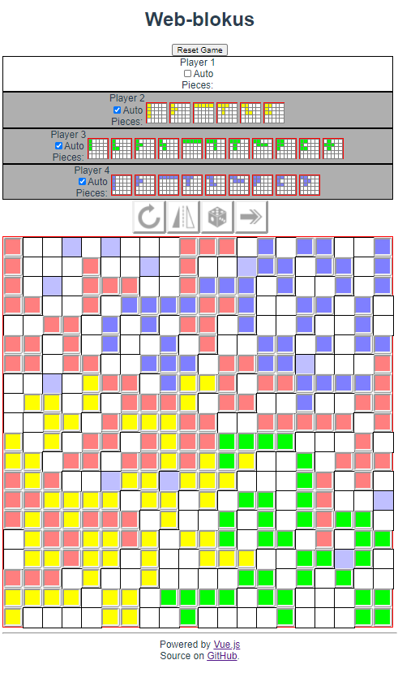
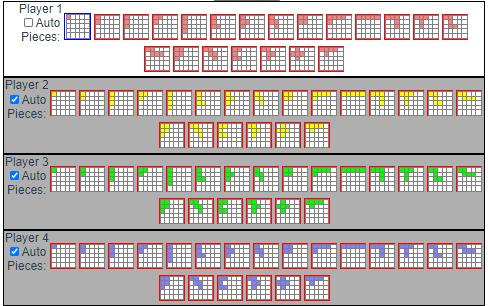

# web-blokus

Try it now on your browser! https://msakuta.github.io/web-blokus/

## What is this?

Blokus is a board game that can be playerd with 2-4 people.
I wanted to implement the game and see if I can implement decent AI player.



## Controls

On top of the screen is the players list.
You can play 4 players' moves manually or check Auto to automatically try to put
blocks with non-AI (just a random pick).




###  Rotate button

Rotate currently selected player's current block.

###  Flip button

Flip currently selected player's current block horizontally.

###  Random placement button

Try to place a tile randomly. It will try 100 times with randomly generated
options, and then it will give up and pass if it cannot find a solution within these tries.

###  Pass button

Pass current player's turn and give it to next player.


## Project setup
```
npm install
```

### Compiles and hot-reloads for development
```
npm run serve
```

### Compiles and minifies for production
```
npm run build
```

### Lints and fixes files
```
npm run lint
```

### Customize configuration
See [Configuration Reference](https://cli.vuejs.org/config/).
